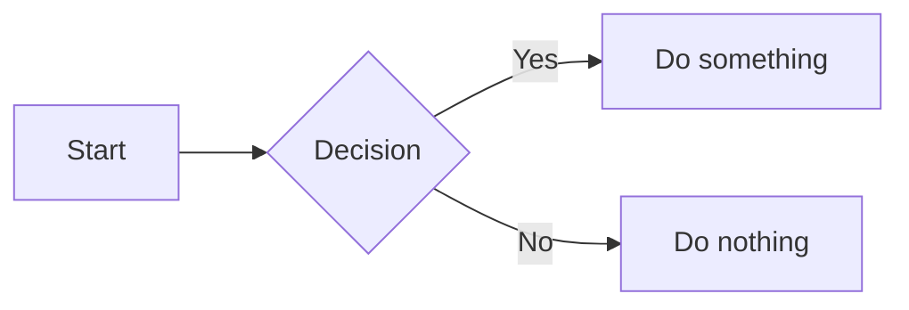

# Interactive Template

The **interactive-light** and **interactive-dark** templates extend the default MdStyled layout with client-side interactivity. Apply either one with **MdStyled: Apply Template**.

---

## Features at a glance

| Feature | How to use |
|---|---|
| Callout blocks | `<!-- .note -->`, `<!-- .warning -->`, `<!-- .danger -->`, `<!-- .success -->` |
| Task progress bar | Any `- [ ]` / `- [x]` checkbox list |
| Collapsible sections | Automatic — every heading becomes an accordion |
| Table of contents | Automatic — right sidebar, all heading levels |
| Interactive tables | Automatic — every Markdown table gets search, sort, and pagination |
| Cards | `<!-- .cards -->` before any unordered list |
| Mermaid diagrams | ` ```mermaid ` code blocks |

---

## Callout variants

Apply a callout class to the next block using a comment selector.

```md
<!-- .note -->
This is a note. Use it for tips, hints, or supplementary information.

<!-- .warning -->
This is a warning. Use it for actions that may have side effects.

<!-- .danger -->
This is a danger block. Use it for irreversible or destructive actions.

<!-- .success -->
This is a success block. Use it for confirmations and positive outcomes.
```

Each variant renders with a colored left border, tinted background, and a lead icon:

| Class | Icon | Use for |
|---|---|---|
| `.note` | ℹ | Tips, info, supplementary detail |
| `.warning` | ⚠ | Caution, potential side effects |
| `.danger` | ✕ | Destructive or irreversible actions |
| `.success` | ✓ | Confirmations, positive outcomes |

Callouts work on any block — paragraphs, lists, blockquotes, code blocks.

---

## Task progress bar

A progress bar is injected automatically above every checkbox list. Checkboxes are interactive — check and uncheck them and the bar updates live.

```md
- [x] Step one
- [x] Step two
- [ ] Step three
- [ ] Step four
```

The bar fills as tasks are checked and turns green when all items are done. Progress resets when the preview reloads (changes are not written back to the source file).

Multiple independent lists on the same page each get their own progress bar.

---

## Collapsible sections

Every heading (`h1`–`h6`) becomes an accordion automatically. A chevron toggle button appears to the left of each heading.

- Click the toggle to collapse the section and hide its content
- Click again to expand
- Nested headings collapse independently — collapsing a parent hides all children; collapsing a child keeps the parent open
- Hover over a toggle to see a subtle rounded background

No markup changes are needed. The accordion is applied to the rendered HTML by the template script.

---

## Table of contents

A sticky right sidebar is generated from all headings in the document. It:

- Shows H1–H6 with hierarchical indentation (H1 bold, deeper levels indented 12 px per step)
- Highlights the currently visible section as you scroll
- Immediately activates the correct entry when you click a TOC link

The TOC is built after the accordion restructures the DOM, so heading positions are always accurate.

---

## Interactive tables

Every Markdown table automatically gets:

### Search

Type in the full-width search box above a table to filter rows across all columns.

To search a specific column, type `ColumnName: term`. Autocomplete suggests column names as you type.

```
Status: active
```

### Sorting

Click any column header to sort ascending. Click again to sort descending. An arrow indicator shows the active sort direction.

### Pagination

Tables with more than 10 rows are paginated. Navigation controls appear below the table showing the current range and total count.

---

## Mermaid diagrams

Fenced code blocks with the `mermaid` language tag are rendered as diagrams.

```md

```

Supported diagram types include flowcharts, sequence diagrams, Gantt charts, pie charts, class diagrams, and more. See the [Mermaid documentation](https://mermaid.js.org) for the full syntax reference.

---

## Switching between light and dark

Both variants are functionally identical — only colors differ. To switch:

1. Run **MdStyled: Apply Template**
2. Choose `interactive-dark` (or `interactive-light`)
3. Select **Overwrite** or **New name** for the existing files

The preview updates immediately after the new files are saved.

---

## Cards

Apply `<!-- .cards -->` to an unordered list to render each item as a card in a responsive grid.

```md
<!-- .cards -->
- **Getting started**

  Install the extension and apply a template to your first Markdown file.

- **Core syntax**

  Use comment selectors and frontmatter directives to attach styles and scripts.

- **Templates**

  Choose from default or interactive themes — light and dark variants available.
```

Each `- **Bold title**` becomes the card heading. Any following text becomes the card body. Nested lists inside a card item are also supported for bullet details.

The grid auto-fills columns at a minimum of 220 px each and reflows as the panel width changes. Cards lift slightly on hover.

---

## Combining with custom CSS

The template CSS is a starting point. Edit `.mdstyled/interactive-light.css` (or dark) to override any style. Add your own classes and apply them with comment selectors.

```md
<!-- .highlight-box -->
This paragraph uses a custom class defined in your CSS.
```

```css
/* in your .mdstyled/interactive-light.css */
.highlight-box {
  border: 2px dashed #3578e5;
  padding: 12px 16px;
  border-radius: 6px;
}
```

---

## Sample file

A ready-to-use demo is included at [`samples/interactive.md`](samples/interactive.md). It covers every feature on a single page and is a good starting point for exploring the template.
