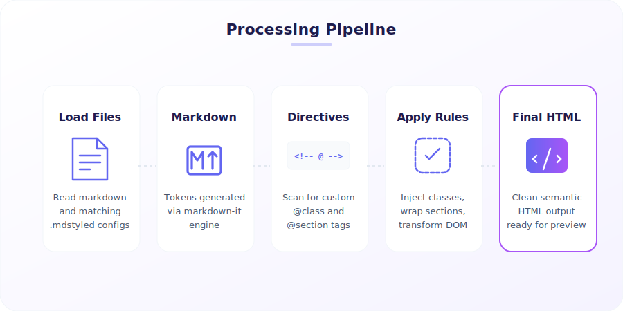

# MdStyled

Style Markdown in VS Code with external CSS and JavaScript, without cluttering the Markdown itself.

<p align="center">
  
</p>

MdStyled is a VS Code extension for authors who want rich, branded, interactive Markdown previews while keeping source files portable and AI-friendly. Add CSS and JS with frontmatter or invisible HTML comments, then open a live preview inside VS Code.

## How to use

1. Install **MdStyled** in VS Code.
2. Open any Markdown file.
3. Run **MdStyled: Apply Template** to scaffold a starter theme.
4. Run **MdStyled: Open Preview** to see the styled result.
5. Edit your Markdown, CSS, or JS and watch the preview refresh live.

### Minimal example

Put this at the top of a Markdown file:

```md
<!-- @style: ./theme.css -->
<!-- @script: ./behavior.js -->

# Product Brief

<!-- .hero -->
Build polished Markdown documents with normal web tools.
```

Then create `theme.css`:

```css
.hero {
  padding: 1rem 1.25rem;
  border-left: 4px solid #2563eb;
  background: #eff6ff;
  font-size: 1.1rem;
}
```

Open **MdStyled: Open Preview** and the paragraph under `# Product Brief` will render with the `hero` class applied.

## Why MdStyled

- Keep Markdown clean while styling the preview with real CSS and JavaScript
- Apply classes, IDs, and attributes using invisible comment selectors
- Build branded documentation, slide-like pages, reports, and interactive notes
- Use local assets instead of forcing presentation markup into the document body
- Preview everything directly inside VS Code

## Core syntax

### Attach styles and scripts

```md
<!-- @style: ./theme.css -->
<!-- @script: ./behavior.js -->
```

You can also use frontmatter:

```md
---
mdstyled:
  styles:
    - ./theme.css
  scripts:
    - ./behavior.js
---
```

### Apply selectors to the next block

```md
<!-- .callout -->
Important note

<!-- #hero -->
# Landing Page

<!-- [data-theme=dark] -->
## Themed section
```

These comments are removed from the final preview and only affect the next renderable block.

## What you can do

| Syntax | Result |
|---|---|
| `<!-- .class -->` | Add one or more classes to the next block |
| `<!-- #id -->` | Set an `id` on the next block |
| `<!-- [key=value] -->` | Add an attribute to the next block |
| `<!-- @style: ./file.css -->` | Load a CSS file into the preview |
| `<!-- @script: ./file.js -->` | Load a JS file into the preview |
| `<!-- @section: name -->` | Wrap the following heading and content in a named `<section>` |
| `<!-- @page: name -->` | Wrap the full document in `<div class="mdstyled-root name">` |

## Built-in extras

MdStyled ships with a few built-in preview extensions:

| Extension | What it does |
|---|---|
| `mermaid` | Renders ` ```mermaid ` blocks as diagrams |
| `copy-code` | Adds copy buttons to code blocks |
| `highlight` | Applies basic code block styling |

Enable or disable them in VS Code settings:

```json
{
  "mdstyled.extensions.enabled": ["mermaid", "copy-code", "highlight"]
}
```

## Commands

| Command | Description |
|---|---|
| `MdStyled: Open Preview` | Open the styled preview in the current editor area |
| `MdStyled: Open Preview to Side` | Open the styled preview beside the current editor |
| `MdStyled: Apply Template` | Create a starter `.mdstyled/` folder and insert directives |

## Auto-discovery

If a Markdown file has matching companion files, MdStyled can load them automatically:

- `example.md` -> `example.css`
- `example.md` -> `example.js`
- `example.md` -> `example.mdstyled`
- `example.md` -> `example.mdjs`

You can also define shared defaults with `mdstyled.config.json`.

## Sample files

The repository includes examples in [`samples/`](/Users/osama.abusitta/repositories/MDCSS/code/samples):

- `basic.md`
- `test-all.md`
- `docusaurus.md`
- `rcm-deployment.md`
- `test-diagram.md`

## Development

```bash
npm run compile
npm run watch
```

Press `F5` in VS Code to launch an Extension Host for local testing.

## License

MIT
