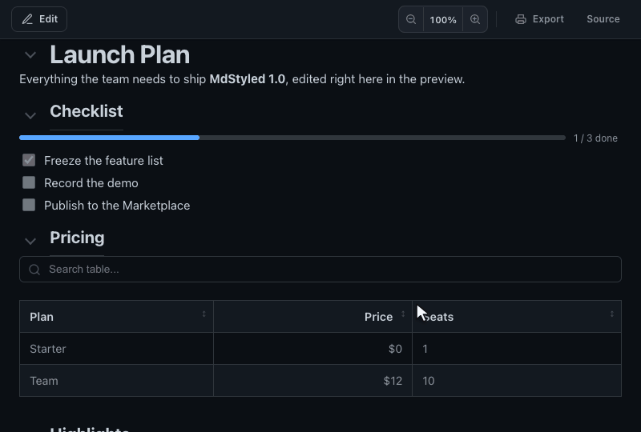

# MdStyled

**Edit Markdown visually, right inside a beautifully styled preview. Your `.md` files stay clean.**

[](https://marketplace.visualstudio.com/items?itemName=OAS.mdstyled)
[](https://marketplace.visualstudio.com/items?itemName=OAS.mdstyled)
[](LICENSE)

<p align="center">
  
</p>

MdStyled turns any Markdown file into a polished, interactive page inside VS Code, and lets you **edit it right there**: click a paragraph and type, press Enter to add a list item, lay out tables and card grids in visual designers. Every change is written straight back to plain, portable Markdown, the format your team, your Git history, and your AI tools read best.

- ✏️ **Click any block to edit it** in rich text, with the Markdown one click away
- 📊 **Table designer**: add, move, and align rows and columns; paste from a spreadsheet
- 🗂️ **Card designer**: build card grids and choose columns and rows visually
- 🎨 **Six ready-made themes**, light and dark, or style it with your own CSS and JavaScript
- 📤 **Export** to a self-contained HTML page or a print-ready PDF
- 🧼 **Clean source, always**: no proprietary syntax, no inline styling in your Markdown

## Get started in 30 seconds

1. Install **MdStyled** from the VS Code Marketplace.
2. Right-click any `.md` file (in the Explorer or in the editor) and choose **MdStyled Edit**.
3. Click any block and start typing. Press `Ctrl`/`Cmd`+`Enter` to save.

**MdStyled Edit** opens the file with the editable theme in light or dark to match your VS Code theme, straight into edit mode. It changes nothing in your file until you save an edit.

Prefer to just read? Use **Open with MdStyled** from the same menu, or the MdStyled icon in the editor title bar.

## The editor

Turn on **Edit** in the top bar (or open with **MdStyled Edit**) and every block of the document becomes editable in place.

### Click to edit

Click a paragraph, heading, list, quote, or code block and it opens in a rich text editor, with the caret exactly where you clicked.

- **Formatting**: bold, italic, strikethrough, inline code, links, text colour and highlight
- **Emoji**: pick from the emoji panel, or type `:` and a name (`:rocket`) for suggestions
- **Turn into**: change a block between text, headings 1 to 6, bullet, numbered, and check lists, quotes, code blocks, and tables
- **Callouts**: style any block as a Note, Success, Warning, or Danger callout
- **Markdown view**: one toggle swaps the rich editor for that block's raw Markdown, and back
- **Save** with `Ctrl`/`Cmd`+`Enter`, **cancel** with `Esc`, and **delete** with a two-click confirm

### Lists that behave

- `Enter` adds the next item, with a fresh checkbox in a checklist, and splits an item in two when the caret is mid-text
- `Enter` on an empty item ends the list and starts a paragraph; numbered lists keep counting after it
- `Tab` and `Shift`+`Tab` indent and outdent
- Ticking a checkbox writes `- [x]` to the file, and nothing else about the list changes

### Table designer

Click a table to edit it as a grid of cells.

- Edit headers and cells directly; `Enter` moves down a row and adds a new row at the end
- Insert, move, and delete rows and columns
- Align each column left, centre, or right
- Paste cells copied from Excel or Google Sheets and the table grows to fit
- Saves as a neatly padded Markdown table

### Card designer

Click a card grid to design it visually.

- Edit each card's header and content
- Add, duplicate, reorder (drag or arrows), and remove cards
- Choose 1 to 4 columns and add or remove whole rows
- Insert a new grid from the **+** menu under **Cards**

### Insert anywhere

In edit mode, hover the gap between any two blocks and a **+** appears. It adds a heading, text, a list, a checklist, a callout, a quote, a card grid, a code block, a table, or a divider exactly at that point.

### Safe by design

- Edits are written to the real `.md` file on disk, not to a copy
- A block that is written in a style the rich editor cannot reproduce exactly (a hard-wrapped paragraph, `_italic_`, `*` bullets) opens as Markdown instead, so your formatting is never silently rewritten
- If the file changed on disk since the preview was drawn, the save is refused rather than overwriting the newer text
- After a save the preview re-renders and keeps the block you edited in the same place on screen
- Want a read-only preview? Set `mdstyled.editing.enabled` to `false`

## Themes

Right-click a Markdown file and open **MdStyled Templates** to apply one to that file:

| Template | What you get |
|---|---|
| **Editable** (light, dark) | Everything below, plus the in-preview editor and designers |
| **Interactive** (light, dark) | Searchable, sortable, paginated tables; collapsible sections; callouts; task progress bars; card grids |
| **Default** (light, dark) | A clean documentation layout: table of contents, copy buttons, syntax highlighting, Mermaid diagrams |

Applying a template copies it into a `.mdstyled/` folder next to the file and adds two lines at the top of the file pointing at it. From then on the files are yours to change.

Or skip that entirely and set a **global default**: the first time you preview an unstyled file, MdStyled asks which template to use for every file that has no styling of its own. Nothing is written to your files. Change it any time with **MdStyled: Set Default Template** or the `mdstyled.defaultTemplate` setting (`none` keeps unstyled files unstyled).

## Style it your way

Every theme is plain CSS and JavaScript, so you can use your own. Attach them with invisible comments at the top of the file:

```md
<!-- @style: ./theme.css -->
<!-- @script: ./behavior.js -->

# Product Brief

<!-- .hero -->
Build polished Markdown documents with normal web tools.
```

```css
.hero {
  padding: 1rem 1.25rem;
  border-left: 4px solid #2563eb;
  background: #eff6ff;
  font-size: 1.1rem;
}
```

The paragraph under `# Product Brief` renders with the `hero` class. The comments never show up in the preview, and on GitHub or any other Markdown viewer the file still reads as ordinary Markdown.

| Syntax | Result |
|---|---|
| `<!-- .class -->` | Add one or more classes to the next block |
| `<!-- #id -->` | Set an `id` on the next block |
| `<!-- [key=value] -->` | Add an attribute to the next block |
| `<!-- @style: ./file.css -->` | Load a CSS file into the preview |
| `<!-- @script: ./file.js -->` | Load a JavaScript file into the preview |
| `<!-- @section: name -->` | Wrap the following heading and its content in a named `<section>` |
| `<!-- @page: name -->` | Wrap the whole document in `<div class="mdstyled-root name">` |

Prefer frontmatter? That works too:

```md
---
mdstyled:
  styles:
    - ./theme.css
  scripts:
    - ./behavior.js
---
```

**Auto-discovery:** companion files with the same name load automatically: `guide.md` picks up `guide.css`, `guide.js`, `guide.mdstyled`, and `guide.mdjs`. Shared defaults can live in `mdstyled.config.json`.

## Built in

- **Mermaid diagrams**: fenced ` ```mermaid ` blocks render as flowcharts, sequence diagrams, Gantt charts, and more
- **Copy buttons** on every code block
- **Code highlighting**
- **Links between documents**: click a link to another `.md` file to open it in the preview, with a Back button
- **Zoom** from 60% to 200% (`Ctrl`/`Cmd` with `+`, `-`, `0`)

Turn the built-in extras on or off with `mdstyled.extensions.enabled`.

## Export

**MdStyled: Export to...** (also in the right-click menu and the preview's top bar) saves the styled page as:

- **HTML**: one self-contained file with the styling baked in, ready to share or host
- **PDF**: a print-ready page, saved from the print dialog

## Commands and menus

Right-click a Markdown file (Explorer, editor, or editor tab):

| Menu item | What it does |
|---|---|
| **Open with MdStyled** | Open the styled preview |
| **MdStyled Edit** | Open straight into editing with the editable theme; your file is untouched until you save |
| **MdStyled Templates** | Apply one of the six templates to the file and open the preview |
| **Export to...** | Export the styled page as HTML or PDF |

Command palette:

| Command | What it does |
|---|---|
| `MdStyled: Open Preview` | Open the styled preview in the current editor area |
| `MdStyled: Open Preview to Side` | Open the styled preview beside the editor |
| `MdStyled Edit` | Open the file in the editor, as in the menu |
| `MdStyled: Apply Template` | Pick a template to apply to the current file |
| `MdStyled: Apply Template: <name>` | Apply a specific template |
| `MdStyled: Set Default Template` | Choose the global default for files with no styling |
| `MdStyled: Export to...` | Export as HTML or PDF |

## Settings

| Setting | Default | What it does |
|---|---|---|
| `mdstyled.defaultTemplate` | asks once | Template for files that declare no styling of their own; `none` for none |
| `mdstyled.editing.enabled` | `true` | Allow templates to edit the file from the preview; `false` makes previews read-only |
| `mdstyled.extensions.enabled` | all | Built-in extras: `mermaid`, `copy-code`, `highlight` |

## For template authors

Every preview exposes `window.mdstyled`, so any template can offer editing of its own:

```js
var api = window.mdstyled.editor;

if (api.available) {
  // Markdown source for lines [start, end) of the file
  var text = api.getSource(4, 7);

  // render a snippet with the preview's own pipeline
  api.render('## A heading').then(function (html) { /* ... */ });

  // write it back and save the file
  api.saveBlock(4, 7, text + '\n\nAdded from the preview.', text)
    .then(function () { /* the preview re-renders */ });
}
```

| Member | Purpose |
|---|---|
| `available` | Whether this preview can write to the file |
| `lineCount` | Lines in the Markdown file |
| `getSource(start, end)` | The file's lines `[start, end)` |
| `getDocument()` | The whole file |
| `render(markdown)` | Render a snippet to HTML with the preview's pipeline |
| `saveBlock(start, end, text, original)` | Replace lines `[start, end)`; a zero-length range inserts and an empty `text` deletes. `original` is what you loaded: the save is refused if the file no longer matches |
| `setEditorOpen(bool)` | Ask the preview not to re-render over an open editor |

Every top-level block carries `data-mdstyled-line="start,end"` pointing at the lines it came from, and links and images carry `data-mdstyled-uri` with their authored path. `window.mdstyled.getState()` and `setState()` keep small values (scroll position, UI state) across the re-render that follows a save. Writing is gated by `mdstyled.editing.enabled`, which is worth knowing if you run template JavaScript you did not write.

## Samples

See [`samples/`](https://github.com/OsamaAbuSitta/MDStyled/tree/main/samples) for example documents, including `interactive.md` (tables, cards, diagrams, callouts) and `default.md`.

## Contributing

```bash
npm install
npm run compile          # one-shot build
npm run watch            # rebuild on change
npm test                 # serializer, write-back, editor, and designer suites
npm run build:templates  # regenerate templates/editable-*
```

The `editable-*` templates are generated from `interactive-*` plus the shared editor in `scripts/editable-template/`. Edit those sources and run `npm run build:templates`; do not hand-edit `templates/editable-*`.

Press `F5` in VS Code to launch the Extension Development Host. `.vscode/launch.json` provides:

| Configuration | What it does |
|---|---|
| **Run Extension** | Builds once, then opens a development host on the current folder |
| **Run Extension (open samples)** | Same, with `samples/` already open so there is Markdown to preview |
| **Run Extension (watch)** | Starts the esbuild watcher first, so edits rebuild while the host runs |

Debugging must go through one of these (`type: extensionHost`). Running `out/extension.js` with the plain Node debugger fails with `Cannot find module 'vscode'`, because that module only exists inside the Extension Host.

Issues and pull requests are welcome on [GitHub](https://github.com/OsamaAbuSitta/MDStyled).

## License

MIT
