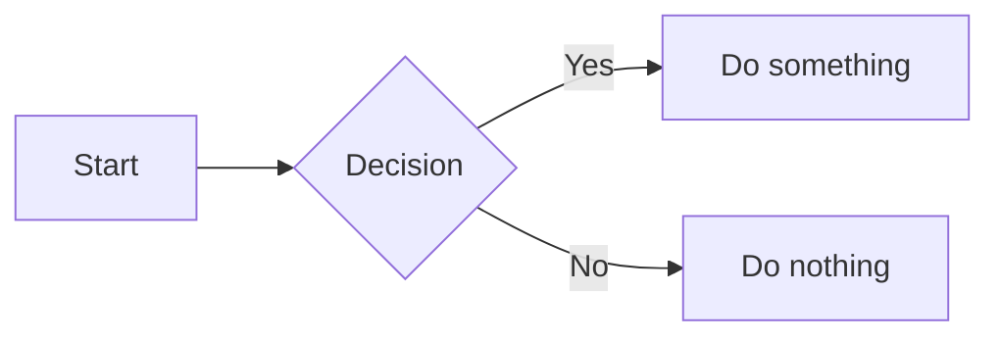

# Interactive Templates

The **interactive-light** and **interactive-dark** templates extend the default layout with client-side interactivity. Apply either one with **MdStyled: Apply Template**.

:::tip
Want editing too? The **[editable templates](./editing)** layer in-preview Markdown editing on top of everything on this page — the most complete MdStyled template.
:::

## Callout blocks

Apply a callout class to the next block using a comment selector:

```md
<!-- .note -->
This is a note. Use it for tips, hints, or supplementary information.

<!-- .warning -->
This is a warning. Use it for actions that may have side effects.

<!-- .danger -->
This is a danger block. Use it for irreversible or destructive actions.

<!-- .success -->
This is a success block. Use it for confirmations and positive outcomes.
```

| Class | Icon | Use for |
|---|---|---|
| `.note` | ℹ | Tips, info, supplementary detail |
| `.warning` | ⚠ | Caution, potential side effects |
| `.danger` | ✕ | Destructive or irreversible actions |
| `.success` | ✓ | Confirmations, positive outcomes |

Callouts work on any block — paragraphs, lists, blockquotes, and code blocks.

## Task progress bar

A progress bar appears automatically above every checkbox list. Check and uncheck items and the bar updates live:

```md
- [x] Step one
- [x] Step two
- [ ] Step three
- [ ] Step four
```

The bar fills as tasks are checked and turns green when everything is done. Multiple independent lists each get their own bar.

## Collapsible sections

Every heading (`h1`–`h6`) becomes an accordion automatically. Click the chevron to collapse or expand a section.

- Nested headings collapse independently — collapse a parent and all children hide.
- No markup changes needed — it's applied to the rendered HTML by the template script.

## Interactive tables

Every Markdown table automatically gets:

| Feature | How it works |
|---|---|
| **Full-width search** | Type to filter rows across all columns |
| **Column search** | Type `ColumnName: term` to search one column (autocomplete included) |
| **Sortable headers** | Click to sort ascending, click again for descending |
| **Pagination** | Tables over 10 rows get Prev / Next / page controls |

## Table of contents

The right sidebar shows all heading levels (H1–H6) with hierarchical indentation and scroll-aware active highlighting. Clicking an entry scrolls to the heading and highlights it.

## Mermaid diagrams

Fenced code blocks with the `mermaid` language tag are rendered as diagrams:

```md

```

Supported types include flowcharts, sequence diagrams, Gantt charts, pie charts, class diagrams, and more. See the [Mermaid documentation](https://mermaid.js.org) for the full syntax.

## Cards

Apply `<!-- .cards -->` to an unordered list to render each item as a card in a responsive grid:

```md
<!-- .cards -->
- **Getting started**

  Install the extension and apply a template to your first Markdown file.

- **Core syntax**

  Use comment selectors and frontmatter directives to attach styles and scripts.

- **Templates**

  Choose from default or interactive themes — light and dark variants available.
```

Each `- **Bold title**` becomes the card heading, with the following text as the card body.

## Switching between light and dark

Both variants are functionally identical — only colors differ. Run **MdStyled: Apply Template**, choose the other variant, and select **Overwrite** or **New name**.

## Customizing further

The template CSS is a starting point. Edit `.mdstyled/interactive-light.css` (or dark) to override anything, and add your own classes:

```md
<!-- .highlight-box -->
This paragraph uses a custom class defined in your CSS.
```

```css
/* in your .mdstyled/interactive-light.css */
.highlight-box {
  border: 2px dashed #3578e5;
  padding: 12px 16px;
  border-radius: 6px;
}
```