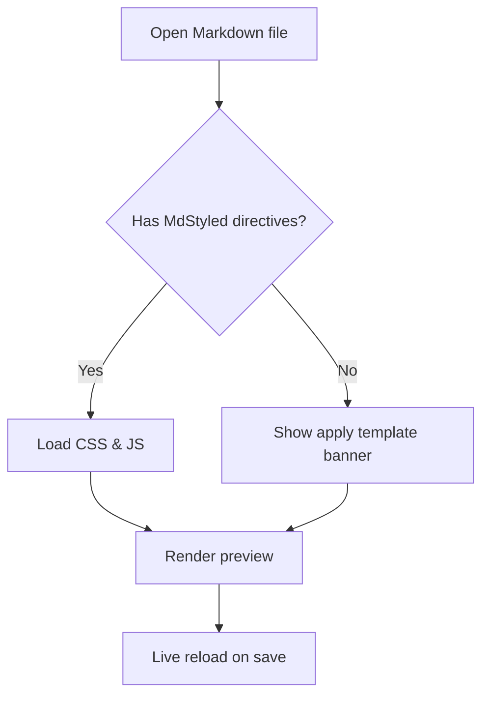
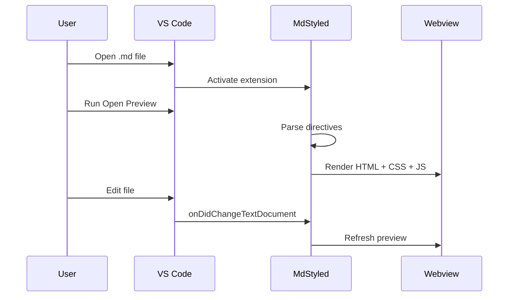
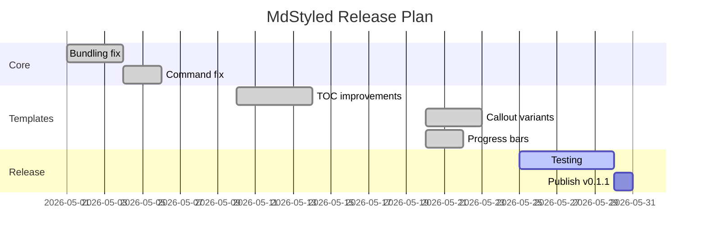

<!-- @style: ./.mdstyled/interactive-light.css -->
<!-- @script: ./.mdstyled/interactive-light.js -->

# Interactive Template Demo

A complete showcase of the **interactive-light** (or **interactive-dark**) template features.
Apply a template with **MdStyled: Apply Template** and open the preview with **MdStyled: Open Preview**.

---

## Callout Variants

Use comment selectors to attach `.note`, `.warning`, `.danger`, or `.success` to any block.

<!-- .note -->
**Note:** Use this for general information or tips that help the reader but aren't critical.

<!-- .warning -->
**Warning:** This action may have unintended side effects. Review carefully before proceeding.

<!-- .danger -->
**Danger:** This operation is irreversible. All data in the selected scope will be permanently deleted.

<!-- .success -->
**Success:** Your configuration has been validated and saved successfully.

---

## Task Progress Bar

Every checkbox list automatically gets an interactive progress bar. Check items off to see it update.

### Release checklist

- [x] Write unit tests
- [x] Update changelog
- [x] Review pull request
- [ ] Merge to main
- [ ] Tag release
- [ ] Publish to marketplace
- [ ] Announce on social

### Onboarding checklist

- [x] Install VS Code
- [x] Install MdStyled extension
- [ ] Apply a template
- [ ] Open first preview
- [ ] Customise the CSS

---

## Collapsible Sections

Every heading becomes an accordion. Click ▼ to collapse or expand a section.

### Introduction

MdStyled lets you style Markdown previews with external CSS and JavaScript without modifying the source document. Directives are written as invisible HTML comments that are stripped from the final output.

### Core concepts

#### Comment selectors

Apply CSS classes, IDs, or attributes to the next rendered block using HTML comments:

```md
<!-- .hero -->
# My Page Title

<!-- #callout -->
Important paragraph here.

<!-- [data-theme=dark] -->
## Dark section
```

##### Class selectors

The most common selector. Use a dot prefix to add one or more classes.

```md
<!-- .note.warning -->
This paragraph gets both `.note` and `.warning` classes.
```

###### Multiple classes

You can chain as many classes as needed. They are applied in the order written.

#### Frontmatter directives

Load stylesheets and scripts from the document's YAML frontmatter:

```yaml
---
mdstyled:
  styles:
    - ./theme.css
  scripts:
    - ./behavior.js
---
```

#### Auto-discovery

MdStyled automatically loads companion files with matching names:

| Pattern | Loaded as |
|---|---|
| `doc.css` | Stylesheet |
| `doc.js` | Script |
| `doc.mdstyled` | Combined config |

---

## Interactive Tables

Every table gets a search box, column-specific filtering, sortable headers, and pagination.

### API reference

| Method | Endpoint | Auth | Description |
|---|---|---|---|
| GET | `/users` | Bearer | List all users |
| POST | `/users` | Bearer | Create a new user |
| GET | `/users/:id` | Bearer | Get user by ID |
| PUT | `/users/:id` | Bearer | Update user |
| DELETE | `/users/:id` | Admin | Delete user |
| GET | `/posts` | None | List public posts |
| POST | `/posts` | Bearer | Create a post |
| GET | `/posts/:id` | None | Get post by ID |
| PUT | `/posts/:id` | Bearer | Update post |
| DELETE | `/posts/:id` | Bearer | Delete post |
| GET | `/comments` | None | List comments |
| POST | `/comments` | Bearer | Add a comment |
| GET | `/comments/:id` | None | Get comment by ID |
| DELETE | `/comments/:id` | Bearer | Delete comment |
| GET | `/tags` | None | List all tags |
| POST | `/tags` | Admin | Create a tag |

### Package comparison

| Package | Version | License | Weekly Downloads | Size |
|---|---|---|---|---|
| markdown-it | 14.1.0 | MIT | 8.2M | 112 KB |
| marked | 12.0.0 | MIT | 15.4M | 56 KB |
| remark | 15.0.1 | MIT | 5.1M | 38 KB |
| unified | 11.0.5 | MIT | 22.1M | 12 KB |
| showdown | 2.1.0 | MIT | 1.3M | 78 KB |
| micromark | 4.0.0 | MIT | 18.6M | 44 KB |

---

## Cards

Apply `<!-- .cards -->` to any unordered list. Each item becomes a card in a responsive grid.

<!-- .cards -->
- **Getting started**

  Install MdStyled, open a Markdown file, and run **Apply Template** to scaffold a theme.

- **Comment selectors**

  Use `<!-- .class -->` before any block to attach CSS classes without modifying the source.

- **Frontmatter directives**

  Load external CSS and JS via YAML frontmatter for clean, portable documents.

- **Live preview**

  The preview refreshes automatically on every file save — edit CSS and see changes instantly.

- **Mermaid diagrams**

  Render flowcharts, sequence diagrams, and Gantt charts with fenced ` ```mermaid ` blocks.

- **Interactive tables**

  Every table gets search, column filtering, sortable headers, and pagination automatically.

---

## Mermaid Diagrams

### Flow diagram



### Sequence diagram



### Gantt chart



---

## Code Blocks

### TypeScript

```typescript
import * as vscode from 'vscode';

export function activate(context: vscode.ExtensionContext) {
  context.subscriptions.push(
    vscode.commands.registerCommand('mdstyled.openPreview', () => {
      const editor = vscode.window.activeTextEditor;
      if (!editor || editor.document.languageId !== 'markdown') {
        vscode.window.showInformationMessage('Active editor is not a Markdown file.');
        return;
      }
      // Open preview panel
    })
  );
}
```

### CSS

```css
.note {
  position: relative;
  padding: 10px 16px 10px 44px;
  margin: 12px 0 20px;
  border-radius: 6px;
  border-left: 4px solid #3578e5;
  background: #f0f6ff;
  color: #1c4e9c;
}

.note::before {
  content: 'ℹ';
  position: absolute;
  left: 14px;
  top: 11px;
}
```

---

## Mixed content

You can combine callouts, task lists, and other blocks freely.

<!-- .note -->
The sections below are collapsed by default in accordion mode. Click the toggle button next to any heading to expand or collapse it.

### Project status

<!-- .success -->
Core rendering engine is stable and all known bugs are fixed.

Current release tasks:

- [x] Fix bundling for published extension
- [x] Fix command registration on install
- [x] Fix copy button scroll behaviour
- [x] Fix Apply Template targeting
- [x] Add callout variants
- [x] Add task progress bars
- [ ] Write end-to-end tests
- [ ] Publish v0.1.1

### Known limitations

<!-- .warning -->
Checkboxes in the preview are interactive but changes are not written back to the source file — they reset when the preview reloads.

<!-- .danger -->
Do not load untrusted external scripts via `@script:` directives. The preview runs in a VS Code webview with `unsafe-inline` scripts enabled.
