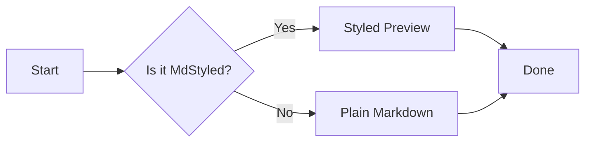
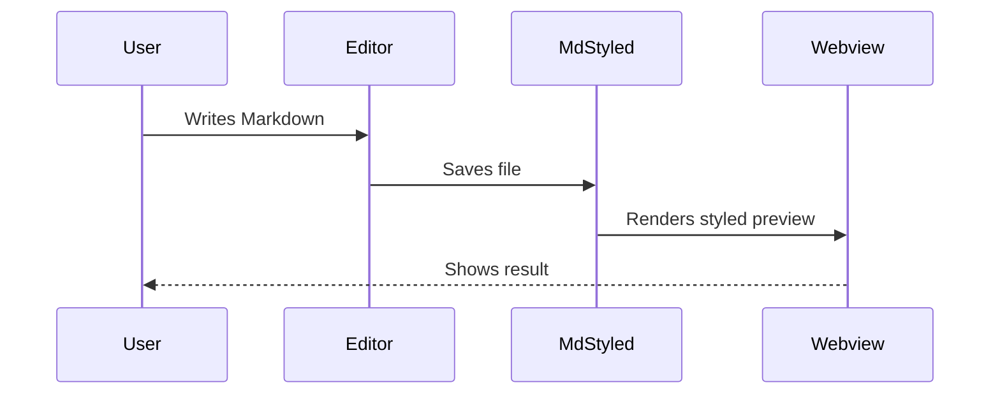

<!-- @style: ./.mdstyled/default-light.css -->
<!-- @script: ./.mdstyled/default-light.js -->


<!-- .page-title -->
# MdStyled Test Page

A comprehensive test of every Markdown element styled with MdStyled.

---

## 1. Headings

<!-- .section-heading -->
### Level 3 Heading

#### Level 4 Heading

##### Level 5 Heading

###### Level 6 Heading

---

## 2. Text Formatting

Plain paragraph with **bold**, *italic*, ~~strikethrough~~, `inline code`, and a [link](https://example.com).

<!-- .highlight -->
This paragraph is highlighted via comment selector.

Subscript: H~2~O, Superscript: X^2^ (requires plugin).

---

## 3. Lists

### Unordered

- Item one
- Item two
- Item three
  - Nested A
  - Nested B
- Item four

### Ordered

1. First step
2. Second step
3. Third step
   1. Sub-step A
   2. Sub-step B

### Task List

- [x] Completed task
- [ ] Pending task
- [ ] Another pending
- [x] Reviewed pull request
- [ ] Update documentation
- [ ] Deploy to staging
- [x] Run test suite
- [ ] Fix CI pipeline
- [x] Merge feature branch

### Definition List

<dl>
  <dt>MdStyled</dt>
  <dd>Markdown + CSS/JS — style previews without polluting source.</dd>
  <dt>Comment Selector</dt>
  <dd>An HTML comment like <code>&lt;!-- .foo --&gt;</code> that applies a class to the next block.</dd>
</dl>

---

## 4. Code Blocks

```js
function fibonacci(n) {
  if (n <= 1) return n;
  return fibonacci(n - 1) + fibonacci(n - 2);
}
console.log(fibonacci(10));
```

```css
.container {
  display: grid;
  grid-template-columns: 1fr 1fr;
  gap: 1rem;
}
```

```bash
# Install dependencies
npm install
npm run compile
code --extensionDevelopmentPath=.
```

```html
<details>
  <summary>Click me</summary>
  Hidden content.
</details>
```

Inline `code` reference inside a paragraph.

---

## 5. Mermaid Diagrams





---

## 6. Tables

| Left | Center | Right |
|---|---|---|
| Default | Right-align | Center |
| Row one | Cell | Cell |
| Row two | Cell | Cell |

| Name | Role | Status |
|---|---|---|
| Alice | Developer | Active |
| Bob | Designer | Contractor |
| Carol | Manager | Leave |

---

## 7. Blockquotes

> Single line blockquote.

> Multi-line quote continues here.
> Second line of the same quote.
>
> Another paragraph inside the quote.

> **Nested quotes:**
> > This is nested two levels deep.
> >
> > > Three levels deep.

---

## 8. Horizontal Rules

Above.

---

Below.

---

## 9. Links and Images

- [VS Code](https://code.visualstudio.com)
- [MdStyled](https://github.com/mdstyled/mdstyled)
- <https://example.com> (autolink)
- Email: <hello@example.com>


---

## 10. HTML in Markdown

<div class="custom-block">
  <strong>Custom HTML block</strong> embedded directly in Markdown.
</div>

<details>
  <summary>Click to expand</summary>

  Hidden content revealed on click. This works because <code>html: true</code> is enabled in markdown-it.

</details>

<kbd>Ctrl</kbd> + <kbd>C</kbd> to copy.

<abbr title="MdStyled">MdStyled</abbr> is an abbreviation.

---

## 11. Mixed Content

<!-- .callout -->
> **Pro Tip:** Comment selectors work on any block element. Combine multiple classes.

A regular paragraph.

<!-- .row
     .card -->
### Card One

Card content with description.

<!-- .row
     .card -->
### Card Two

More card content in a row layout.

---

## 12. Escaping and Special Characters

Literal asterisks: \*not italic\*

Literal backticks: \`not code\`

Ampersand: &amp; AT&amp;T

---

## 13. Line Breaks

First line with two spaces at end ··  
Second line after hard break.

Soft break occurs here·
on the same paragraph.

---

<!-- .page-footer -->
*End of test page — all elements rendered successfully.*
