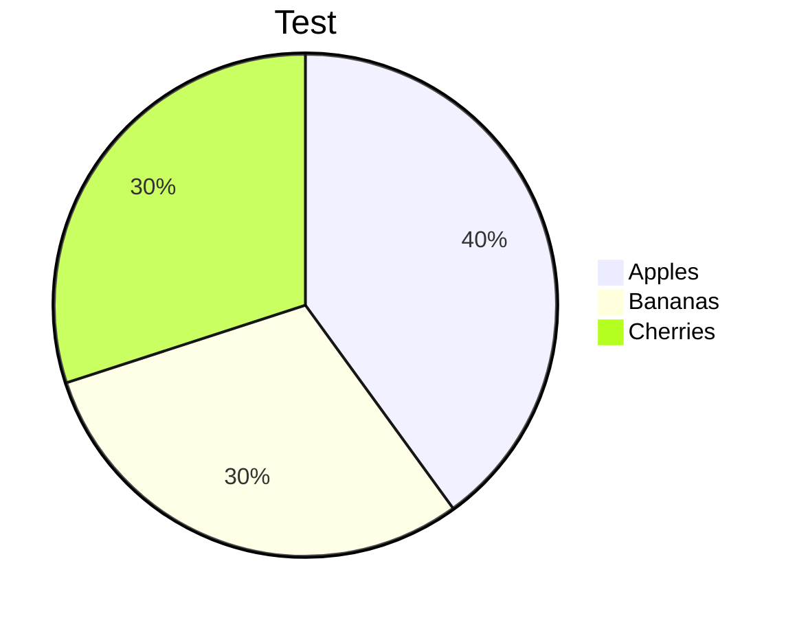
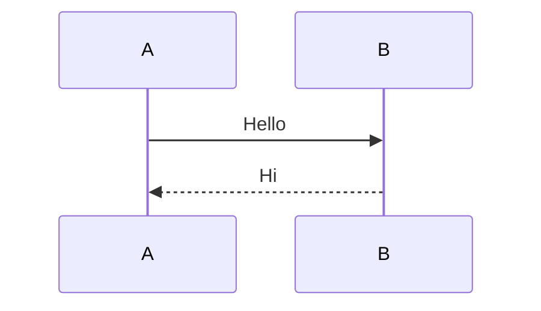

<!-- @style: ./.mdstyled/default-light.css -->
<!-- @script: ./.mdstyled/default-light.js -->

# Basic Mermaid Test

## Simple flowchart (should work)


## Invalid diagram (should show error, not break others)

```mermaid
this is not a valid diagram
```

## Another valid chart (should still render)



## Sequence diagram (should work)


