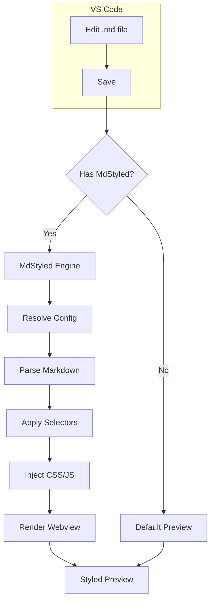
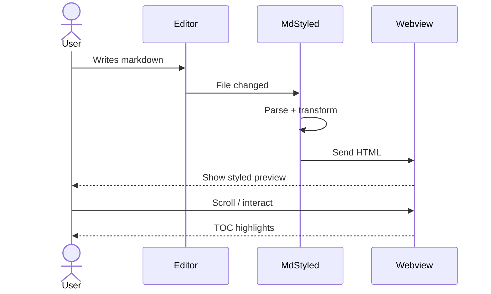
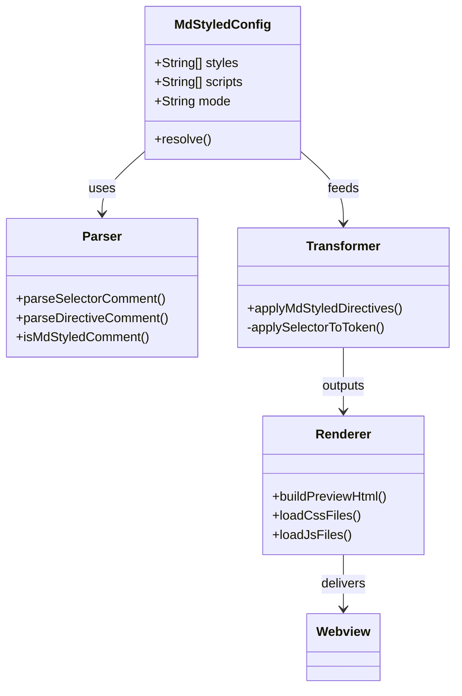
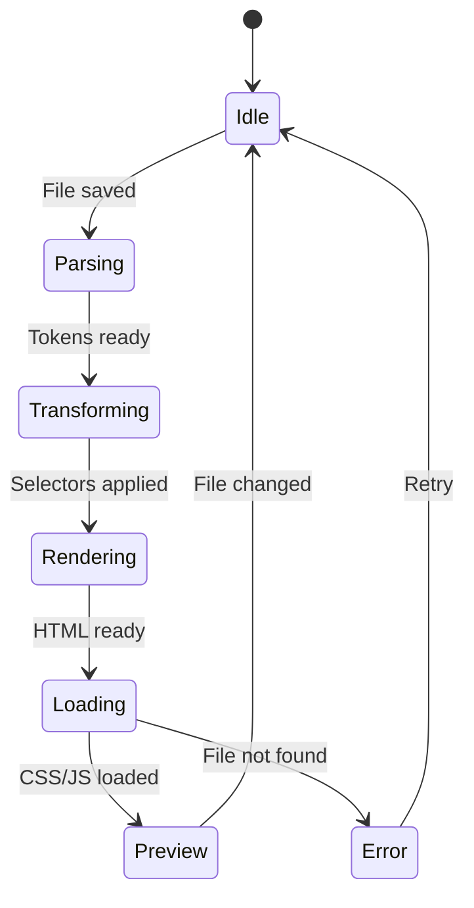
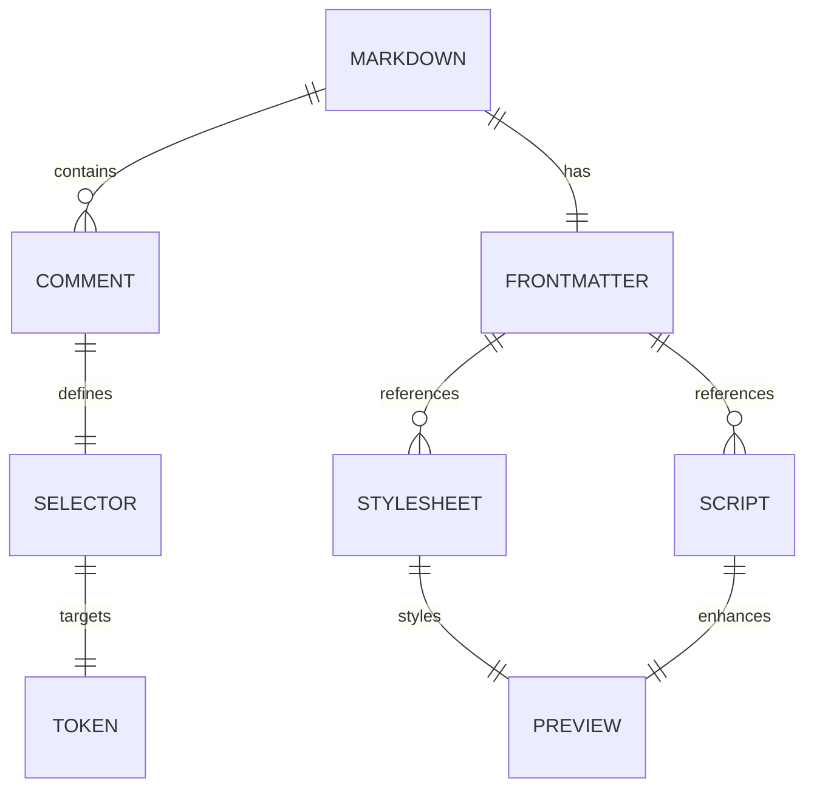
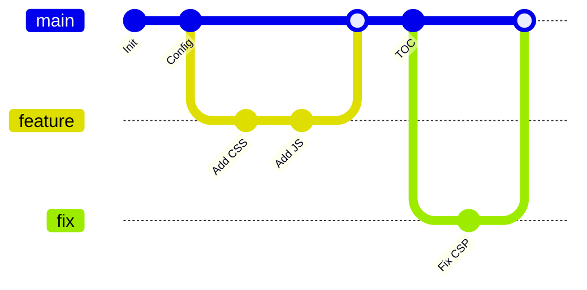
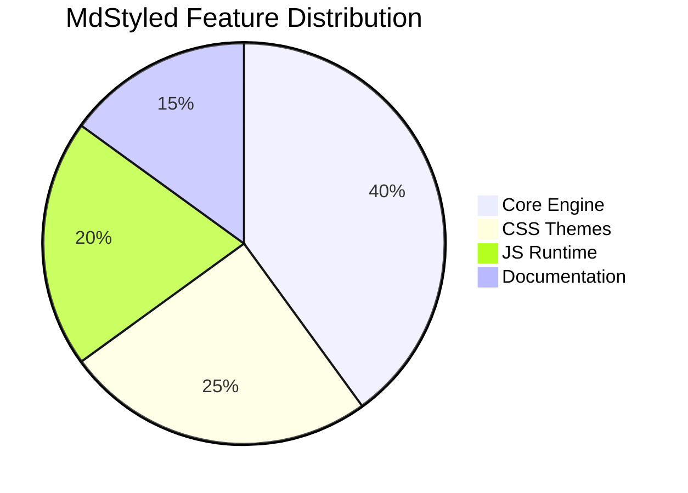
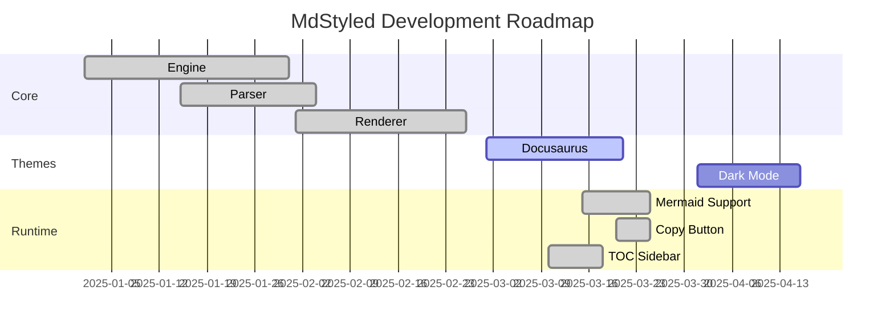
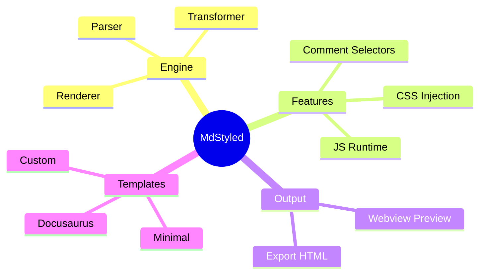

<!-- @style: ./.mdstyled/default-dark.css -->
<!-- @script: ./.mdstyled/default-dark.js -->

<!-- .diagram-hero -->
# Mermaid Diagrams

A showcase of every Mermaid diagram type rendered by MdStyled.

---

## Flowchart

## Sequence Diagram

## Class Diagram

## State Diagram

## Entity Relationship Diagram

## Git Graph

## Pie Chart

## Gantt Chart

## Mindmap

---

<!-- .diagram-footer -->
*All diagrams rendered live by Mermaid via MdStyled.*
